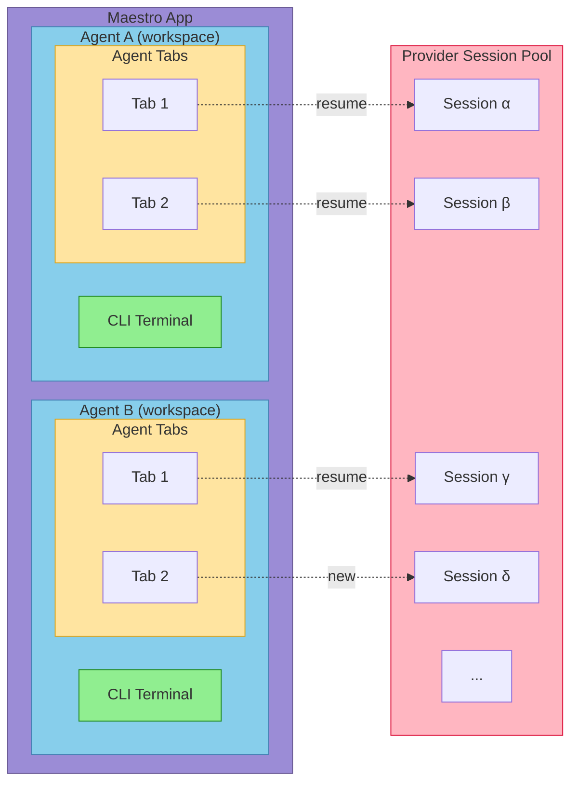

# Architecture Guide

Deep technical documentation for Maestro's architecture and design patterns. For quick reference, see [CLAUDE.md](CLAUDE.md). For development setup, see [CONTRIBUTING.md](CONTRIBUTING.md).

## Table of Contents

- [Dual-Process Architecture](#dual-process-architecture)
- [IPC Security Model](#ipc-security-model)
- [Process Manager](#process-manager)
- [Layer Stack System](#layer-stack-system)
- [State Management](#state-management)
- [Custom Hooks](#custom-hooks)
- [Services Layer](#services-layer)
- [Custom AI Commands](#custom-ai-commands)
- [Theme System](#theme-system)
- [Settings Persistence](#settings-persistence)
- [Claude Provider Sessions API](#claude-provider-sessions-api)
- [Auto Run System](#auto-run-system)
- [Achievement System](#achievement-system)
- [Project Folders](#project-folders)
- [AI Tab System](#ai-tab-system)
- [File Preview Tab System](#file-preview-tab-system)
- [Execution Queue](#execution-queue)
- [Navigation History](#navigation-history)
- [Group Chat System](#group-chat-system)
- [Web/Mobile Interface](#webmobile-interface)
- [CLI Tool](#cli-tool)
- [Shared Module](#shared-module)
- [Remote Access & Tunnels](#remote-access--tunnels)
- [Error Handling Patterns](#error-handling-patterns)

---

## Architecture

Maestro organizes work into **Agents** (workspaces), each with a **CLI Terminal** and multiple **AI Tabs**. Each tab can be connected to a **Provider Session** - either newly created or resumed from the session pool.



## Dual-Process Architecture

Maestro uses Electron's main/renderer split with strict context isolation.

### Main Process (`src/main/`)

Node.js backend with full system access:

| File                      | Purpose                                                       |
| ------------------------- | ------------------------------------------------------------- |
| `index.ts`                | App entry, IPC handlers, window management                    |
| `process-manager.ts`      | PTY and child process spawning                                |
| `web-server.ts`           | Fastify HTTP/WebSocket server for mobile remote control       |
| `agent-detector.ts`       | Auto-detect CLI tools via PATH                                |
| `preload.ts`              | Secure IPC bridge via contextBridge                           |
| `tunnel-manager.ts`       | Cloudflare tunnel management for secure remote access         |
| `themes.ts`               | Theme definitions for web interface (mirrors renderer themes) |
| `utils/execFile.ts`       | Safe command execution utility                                |
| `utils/logger.ts`         | System logging with levels                                    |
| `utils/shellDetector.ts`  | Detect available shells                                       |
| `utils/terminalFilter.ts` | Strip terminal control sequences                              |
| `utils/cliDetection.ts`   | CLI tool detection (cloudflared, gh)                          |
| `utils/networkUtils.ts`   | Network utilities for local IP detection                      |

### Renderer Process (`src/renderer/`)

React frontend with no direct Node.js access:

| Directory     | Purpose                                                                                    |
| ------------- | ------------------------------------------------------------------------------------------ |
| `components/` | React UI components                                                                        |
| `hooks/`      | Custom React hooks organized by domain (20 categories - see [Custom Hooks](#custom-hooks)) |
| `stores/`     | Zustand stores (11 stores - see [State Management](#state-management))                     |
| `services/`   | IPC wrappers (git.ts, process.ts)                                                          |
| `contexts/`   | React contexts (LayerStackContext, ProjectFoldersContext)                                  |
| `constants/`  | Themes, shortcuts, modal priorities                                                        |
| `types/`      | TypeScript definitions                                                                     |
| `utils/`      | Frontend utilities                                                                         |

### Agent Model (Session Interface)

Each agent runs **two processes simultaneously**:

```typescript
interface Session {
	id: string; // Unique identifier
	aiPid: number; // AI agent process (suffixed -ai)
	terminalPid: number; // Terminal process (suffixed -terminal)
	inputMode: 'ai' | 'terminal'; // Which process receives input
	// ... other fields
}
```

This enables seamless switching between AI and terminal modes without process restarts.

---

## IPC Security Model

All renderer-to-main communication uses the preload script:

- **Context isolation**: Enabled (renderer has no Node.js access)
- **Node integration**: Disabled (no `require()` in renderer)
- **Preload script**: Exposes minimal API via `contextBridge.exposeInMainWorld('maestro', ...)`

### The `window.maestro` API

```typescript
window.maestro = {
  // Core persistence
  settings: { get, set, getAll },
  sessions: { getAll, setAll },
  groups: { getAll, setAll },
  history: { getAll, setAll },  // Command history persistence

  // Process management
  process: { spawn, write, interrupt, kill, resize, runCommand, onData, onExit, onSessionId, onStderr, onCommandExit, onUsage },

  // Git operations (expanded)
  git: {
    status, diff, isRepo, numstat,
    branches, tags, branch, log, show, showFile,
    // Worktree operations
    worktreeInfo, worktreeSetup, worktreeCheckout, getRepoRoot,
    // PR creation
    createPR, getDefaultBranch, checkGhCli
  },

  // File system
  fs: { readDir, readFile },

  // Agent management
  agents: { detect, get, getConfig, setConfig, getConfigValue, setConfigValue },

  // Claude Code integration
  claude: { listSessions, readSessionMessages, searchSessions, getGlobalStats, onGlobalStatsUpdate },

  // UI utilities
  dialog: { selectFolder },
  fonts: { detect },
  shells: { detect },
  shell: { openExternal },
  devtools: { open, close, toggle },

  // Logging
  logger: { log, getLogs, clearLogs, setLogLevel, getLogLevel, setMaxLogBuffer, getMaxLogBuffer },

  // Web/remote interface
  webserver: { getUrl, getClientCount },
  web: { broadcastUserInput, broadcastAutoRunState, broadcastTabChange },
  live: { setSessionLive, getSessionLive },
  tunnel: { start, stop, getStatus, onStatusChange },

  // Auto Run
  autorun: { listDocs, readDoc, writeDoc, saveImage, deleteImage, listImages },
  playbooks: { list, create, update, delete },

  // Attachments & temp files
  attachments: { save, list, delete, clear },
  tempfile: { write, read, delete },

  // Activity & notifications
  cli: { trackActivity, getActivity },
  notification: { show, speak },
}
```

---

## Process Manager

The `ProcessManager` class (`src/main/process-manager.ts`) handles two process types:

### PTY Processes (via `node-pty`)

Used for terminal sessions with full shell emulation:

- `toolType: 'terminal'`
- Supports resize, ANSI escape codes, interactive shell
- Spawned with shell (zsh, bash, fish, etc.)

### Child Processes (via `child_process.spawn`)

Used for AI assistants:

- All non-terminal tool types
- Direct stdin/stdout/stderr capture
- **Security**: Uses `spawn()` with `shell: false`

### Batch Mode (Claude Code)

Claude Code runs in batch mode with `--print --output-format json`:

- Prompt passed as CLI argument
- Process exits after response
- JSON response parsed for result and usage stats

### Stream-JSON Mode (with images)

When images are attached:

- Uses `--input-format stream-json --output-format stream-json`
- Message sent via stdin as JSONL
- Supports multimodal input

### Process Events

```typescript
processManager.on('data', (sessionId, data) => { ... });
processManager.on('exit', (sessionId, code) => { ... });
processManager.on('usage', (sessionId, usageStats) => { ... });
processManager.on('session-id', (sessionId, agentSessionId) => { ... });
processManager.on('stderr', (sessionId, data) => { ... });
processManager.on('command-exit', (sessionId, code) => { ... });
```

---

## Layer Stack System

Centralized modal/overlay management with predictable Escape key handling.

### Problem Solved

- Previously had 9+ scattered Escape handlers
- Brittle modal detection with massive boolean checks
- Inconsistent focus management

### Architecture

| File                             | Purpose                               |
| -------------------------------- | ------------------------------------- |
| `hooks/useLayerStack.ts`         | Core layer management hook            |
| `contexts/LayerStackContext.tsx` | Global Escape handler (capture phase) |
| `constants/modalPriorities.ts`   | Priority values for all modals        |
| `types/layer.ts`                 | Layer type definitions                |

### Modal Priority Hierarchy

```typescript
const MODAL_PRIORITIES = {
	STANDING_OVATION: 1100, // Achievement celebration overlay
	CONFIRM: 1000, // Highest - confirmation dialogs
	PLAYBOOK_DELETE_CONFIRM: 950,
	PLAYBOOK_NAME: 940,
	RENAME_INSTANCE: 900,
	RENAME_TAB: 880,
	RENAME_GROUP: 850,
	CREATE_GROUP: 800,
	NEW_INSTANCE: 750,
	AGENT_PROMPT_COMPOSER: 730,
	PROMPT_COMPOSER: 710,
	QUICK_ACTION: 700, // Command palette (Cmd+K)
	TAB_SWITCHER: 690,
	AGENT_SESSIONS: 680,
	EXECUTION_QUEUE_BROWSER: 670,
	BATCH_RUNNER: 660,
	SHORTCUTS_HELP: 650,
	HISTORY_HELP: 640,
	AUTORUNNER_HELP: 630,
	HISTORY_DETAIL: 620,
	ABOUT: 600,
	PROCESS_MONITOR: 550,
	LOG_VIEWER: 500,
	SETTINGS: 450,
	GIT_DIFF: 200,
	GIT_LOG: 190,
	LIGHTBOX: 150,
	FILE_PREVIEW: 100,
	SLASH_AUTOCOMPLETE: 50,
	TEMPLATE_AUTOCOMPLETE: 40,
	FILE_TREE_FILTER: 30, // Lowest
};
```

### Registering a Modal

```typescript
import { useLayerStack } from '../contexts/LayerStackContext';
import { MODAL_PRIORITIES } from '../constants/modalPriorities';

const { registerLayer, unregisterLayer, updateLayerHandler } = useLayerStack();
const layerIdRef = useRef<string>();

// Use ref to avoid re-registration when callback identity changes
const onCloseRef = useRef(onClose);
onCloseRef.current = onClose;

useEffect(() => {
	if (modalOpen) {
		const id = registerLayer({
			type: 'modal',
			priority: MODAL_PRIORITIES.YOUR_MODAL,
			blocksLowerLayers: true,
			capturesFocus: true,
			focusTrap: 'strict', // 'strict' | 'lenient' | 'none'
			ariaLabel: 'Your Modal Name',
			onEscape: () => onCloseRef.current(),
		});
		layerIdRef.current = id;
		return () => unregisterLayer(id);
	}
}, [modalOpen, registerLayer, unregisterLayer]); // onClose NOT in deps
```

### Layer Types

```typescript
type ModalLayer = {
	type: 'modal';
	priority: number;
	blocksLowerLayers: boolean;
	capturesFocus: boolean;
	focusTrap: 'strict' | 'lenient' | 'none';
	ariaLabel?: string;
	onEscape: () => void;
	onBeforeClose?: () => Promise<boolean>;
	isDirty?: boolean;
	parentModalId?: string;
};

type OverlayLayer = {
	type: 'overlay';
	priority: number;
	blocksLowerLayers: boolean;
	capturesFocus: boolean;
	focusTrap: 'strict' | 'lenient' | 'none';
	ariaLabel?: string;
	onEscape: () => void;
	allowClickOutside: boolean;
};
```

### Internal Search Layers

Components like FilePreview handle internal search in their onEscape:

```typescript
onEscape: () => {
	if (searchOpen) {
		setSearchOpen(false); // First Escape closes search
	} else {
		closePreview(); // Second Escape closes preview
	}
};
```

---

## State Management

Maestro uses [Zustand](https://github.com/pmndrs/zustand) for all application state. Eleven stores provide centralized, selector-based state management with no prop drilling and no unnecessary re-renders.

### Store Inventory

| Store         | File                   | Purpose                                             | React Hook             | Non-React Access                                     |
| ------------- | ---------------------- | --------------------------------------------------- | ---------------------- | ---------------------------------------------------- |
| Session       | `sessionStore.ts`      | Sessions, groups, active session, worktree tracking | `useSessionStore`      | `getSessionState()`, `getSessionActions()`           |
| Agent         | `agentStore.ts`        | Agent detection, error recovery, status tracking    | `useAgentStore`        | `getAgentState()`, `getAgentActions()`               |
| Tab           | `tabStore.ts`          | Tab CRUD, unified ordering, selectors               | `useTabStore`          | `getTabState()`, `getTabActions()`                   |
| Modal         | `modalStore.ts`        | Modal registry (31+ modals), open/close state       | `useModalStore`        | `getModalActions()`                                  |
| UI            | `uiStore.ts`           | Sidebar, focus, layout state                        | `useUIStore`           | `getUIState()`                                       |
| Settings      | `settingsStore.ts`     | App config, shortcuts, usage stats                  | `useSettingsStore`     | `getSettingsState()`, `getSettingsActions()`         |
| Group Chat    | `groupChatStore.ts`    | Multi-agent chat orchestration                      | `useGroupChatStore`    | `getGroupChatState()`, `getGroupChatActions()`       |
| Batch         | `batchStore.ts`        | Auto Run state machine                              | `useBatchStore`        | `getBatchState()`, `getBatchActions()`               |
| Operation     | `operationStore.ts`    | Context merge/transfer operations                   | `useOperationStore`    | `getOperationState()`, `getOperationActions()`       |
| Notification  | `notificationStore.ts` | Toast queue, notification lifecycle                 | `useNotificationStore` | `getNotificationState()`, `getNotificationActions()` |
| File Explorer | `fileExplorerStore.ts` | File tree UI state, selection, filter               | `useFileExplorerStore` | `getFileExplorerState()`, `getFileExplorerActions()` |

All stores live in `src/renderer/stores/` and re-export from `stores/index.ts`.

### Dual-Access Pattern

Every store exposes two access modes:

1. **React components** — subscribe via hook with a selector:

```typescript
// Only re-renders when activeSessionId changes
const activeId = useSessionStore((s) => s.activeSessionId);
```

2. **Services, callbacks, and effects** — read/write without subscribing:

```typescript
// Get current state snapshot (no subscription, no re-render)
const { sessions } = getSessionState();

// Dispatch actions from outside React
getSessionActions().updateSession(id, { name: 'New Name' });
```

### Selector Equality Optimization

Zustand uses `Object.is` equality by default. Selecting a primitive field like `useSessionStore((s) => s.activeSessionId)` prevents re-renders when other state changes. For derived data, use `useShallow` or memoized selectors to avoid object identity churn.

---

## Custom Hooks

Hooks are organized by domain in `src/renderer/hooks/<category>/`, with barrel re-exports via `index.ts` files.

### Hook Directory Structure

| Category         | Directory               | Hook Count | Purpose                                                                                                            |
| ---------------- | ----------------------- | ---------- | ------------------------------------------------------------------------------------------------------------------ |
| Agent            | `hooks/agent/`          | 21         | Agent execution, listeners, error recovery, interruption, merge/transfer, queue processing, billing mode           |
| Batch / Auto Run | `hooks/batch/`          | 22         | Batch processor, Auto Run handlers, document loading/polling, worktree management, achievements, marketplace       |
| Git / Files      | `hooks/git/`            | 3          | File tree management, file explorer effects/keyboard, git status polling                                           |
| GPU              | `hooks/gpu/`            | 1          | GPU metrics polling                                                                                                |
| Group Chat       | `hooks/groupChat/`      | 1          | Multi-agent chat handlers                                                                                          |
| Input            | `hooks/input/`          | 7          | Input handlers, key-down processing, @-mention completion, tab completion, template autocomplete, input sync       |
| Keyboard         | `hooks/keyboard/`       | 4          | Main keyboard handler, keyboard navigation, list navigation, shortcut helpers                                      |
| Modal            | `hooks/modal/`          | 3          | Modal handlers, prompt composer, quick actions                                                                     |
| Prompt Library   | `hooks/prompt-library/` | 1          | Prompt library CRUD and search                                                                                     |
| Props            | `hooks/props/`          | 3          | Prop composition for MainPanel, RightPanel, SessionList                                                            |
| Remote           | `hooks/remote/`         | 7          | SSH remotes, live mode, CLI activity monitoring, web broadcasting                                                  |
| Session          | `hooks/session/`        | 14         | Session CRUD, restoration/migration, lifecycle, navigation, group management, activity tracking, filtering/sorting |
| Settings         | `hooks/settings/`       | 2          | Settings management, theme sync                                                                                    |
| Stats            | `hooks/stats/`          | 1          | Usage statistics                                                                                                   |
| Symphony         | `hooks/symphony/`       | 4          | Orchestration contributions and contributor stats                                                                  |
| Tabs             | `hooks/tabs/`           | 2          | Tab CRUD/reorder/close, tab export (gist/markdown)                                                                 |
| UI               | `hooks/ui/`             | 13         | App initialization, layer stack, resizable panels, tooltips, scroll management, theme styles, tour                 |
| Utils            | `hooks/utils/`          | 2          | Debounced persistence, throttle                                                                                    |
| Wizard           | `hooks/wizard/`         | 1          | Inline wizard handlers                                                                                             |
| Worktree         | `hooks/worktree/`       | 1          | Git worktree session handlers                                                                                      |

Top-level hooks (not in subdirectories):

- `useHoneycombUsage.ts` — Honeycomb usage data polling
- `useProjectFolders.ts` — Project folder CRUD via ProjectFoldersContext

### Key Orchestration Hooks

#### useSessionRestoration (`hooks/session/useSessionRestoration.ts`)

Session loading, hydration, migration, and corruption recovery on app startup.

- Migrates legacy session fields (e.g., missing `filePreviewTabs`, stale runtime state)
- Recovers corrupted session data with safe defaults
- Resets runtime state (`sessionState: 'idle'`, clears `isProcessing` flags)
- Coordinates splash screen via `initialLoadComplete` proxy ref (bridges ref API to store boolean)
- Loads both sessions and group chats on mount with React Strict Mode guard

#### useTabHandlers (`hooks/tabs/useTabHandlers.ts`)

Full tab operation set: create, close, reorder, rename, star, undo, file tab navigation.

- Three-layer architecture: `tabHelpers` (pure functions) → `useTabHandlers` (React bridge) → `tabStore` (persistence)
- Close guards: prevents closing tabs with active wizards, drafts, edits, or locked state
- Undo system: dual-stack (`closedAiTabHistory` / `closedFileTabHistory`) with duplicate detection
- File tab navigation: per-tab back/forward history with scroll preservation

#### useFileTreeManagement (`hooks/git/useFileTreeManagement.ts`)

File tree loading, refresh, filtering, and git metadata for both local and SSH remote sessions.

- Uses `sessionsRef` pattern to avoid effect re-triggering (see [sessionsRef Pattern](#sessionsref-pattern))
- Supports SSH remote file trees via `SshContext`
- Derives file/folder counts from loaded tree (avoids SSH `du`/`find` commands)
- Retry logic with 20-second delay on file tree errors

#### useFileExplorerEffects (`hooks/git/useFileExplorerEffects.ts`)

File explorer side effects and keyboard navigation (extracted from App.tsx).

- Scroll position restore on session switch
- Flat file list computation for keyboard-navigable list
- Pending jump path handler (`/jump` command)
- `handleMainPanelFileClick` for `[[wiki]]` links and file path clicks
- `stableFileTree` memo to prevent unnecessary re-renders

#### useAutoRunHandlers (`hooks/batch/useAutoRunHandlers.ts`)

Auto Run orchestration: folder selection, batch run start, document management, content editing.

- Handles worktree creation for batch runs (`buildWorktreeSession`)
- Document list refresh and task count extraction
- Content change persistence and mode switching (edit/preview)

#### useInterruptHandler (`hooks/agent/useInterruptHandler.ts`)

Agent interruption with graceful degradation.

- Sends SIGINT to active process (AI or terminal mode, based on `inputMode`)
- Cancels pending synopsis before interrupting
- Cleans up thinking/tool logs from interrupted tabs
- Processes execution queue after interruption
- Falls back to force-kill if graceful interrupt fails

### Architectural Patterns

#### sessionsRef Pattern

Many hooks accept a `sessionsRef: React.MutableRefObject<Session[]>` dependency. This provides non-reactive access to the current sessions array inside `useCallback` and `useEffect` bodies without triggering effect re-runs:

```typescript
// Instead of this (causes re-runs when sessions change):
const sessions = useSessionStore((s) => s.sessions);
useEffect(() => {
	/* uses sessions */
}, [sessions]); // re-triggers on every session update

// Use this (stable ref, no re-triggers):
const sessionsRef = useRef(sessions);
sessionsRef.current = sessions;
useEffect(() => {
	/* uses sessionsRef.current */
}, []); // runs once
```

This pattern is used in 14 hooks across `agent/`, `batch/`, `git/`, `input/`, `remote/`, `tabs/`, and `utils/` categories.

#### Cascade Avoidance Strategy

Hooks read store state via `useSessionStore.getState()` inside callbacks and effects rather than subscribing to store slices. This prevents cascading re-renders and infinite effect loops:

```typescript
// Stable action references extracted once via useMemo:
const { setSessions, setActiveSessionId } = useMemo(
	() => useSessionStore.getState(),
	[] // Empty deps — Zustand actions are stable singletons
);

// Reading current state inside callbacks (not reactive):
const currentSession = selectActiveSession(useSessionStore.getState());
```

#### Dependency Injection via Interfaces

Most hooks accept a typed `deps` parameter instead of importing dependencies directly. This makes hooks testable and decouples them from specific component trees:

```typescript
interface UseInterruptHandlerDeps {
	sessionsRef: React.RefObject<Session[]>;
	cancelPendingSynopsis: (sessionId: string) => Promise<void>;
	processQueuedItem: (sessionId: string, item: QueuedItem) => Promise<void>;
}

export function useInterruptHandler(deps: UseInterruptHandlerDeps): UseInterruptHandlerReturn {
	// Hook implementation uses deps instead of direct imports
}
```

---

## Services Layer

Services provide clean wrappers around IPC calls.

### Git Service (`src/renderer/services/git.ts`)

```typescript
import { gitService } from '../services/git';

const isRepo = await gitService.isRepo(cwd);
const status = await gitService.getStatus(cwd);
// Returns: { files: [{ path: string, status: string }] }

const diff = await gitService.getDiff(cwd, ['file1.ts']);
// Returns: { diff: string }

const numstat = await gitService.getNumstat(cwd);
// Returns: { files: [{ path, additions, deletions }] }
```

### Process Service (`src/renderer/services/process.ts`)

```typescript
import { processService } from '../services/process';

await processService.spawn(config);
await processService.write(sessionId, 'input\n');
await processService.interrupt(sessionId);  // SIGINT/Ctrl+C
await processService.kill(sessionId);
await processService.resize(sessionId, cols, rows);

const unsubscribe = processService.onData((sessionId, data) => { ... });
```

---

## Custom AI Commands

User-defined prompt macros that expand when typed. The built-in slash commands (`/clear`, `/jump`, `/history`) have been deprecated in favor of fully customizable commands defined in Settings.

### Overview

Custom AI Commands are prompt templates that:

- Start with `/` prefix
- Expand to full prompts when selected
- Support template variables (e.g., `{{date}}`, `{{time}}`, `{{cwd}}`)
- Can be AI-only, terminal-only, or both modes

### Configuration

Commands are defined in Settings → Custom AI Commands:

```typescript
interface CustomAICommand {
	command: string; // e.g., "/review"
	description: string; // Shown in autocomplete
	prompt: string; // The expanded prompt text
	aiOnly?: boolean; // Only show in AI mode
	terminalOnly?: boolean; // Only show in terminal mode
}
```

### Template Variables

Commands support these template variables:

- `{{date}}` - Current date (YYYY-MM-DD)
- `{{time}}` - Current time (HH:MM:SS)
- `{{datetime}}` - Combined date and time
- `{{cwd}}` - Current working directory
- `{{session}}` - Session name
- `{{agent}}` - Agent type (claude-code, etc.)

### Example Commands

```typescript
// Code review command
{
  command: '/review',
  description: 'Review staged changes',
  prompt: 'Review the staged git changes and provide feedback on code quality, potential bugs, and improvements.',
  aiOnly: true
}

// Status check
{
  command: '/status',
  description: 'Project status summary',
  prompt: 'Give me a brief status of this project as of {{datetime}}. What files have been modified recently?',
  aiOnly: true
}
```

### Claude Code CLI Commands

Maestro also fetches slash commands from Claude Code CLI when available, making Claude Code's built-in commands accessible through the same autocomplete interface.

---

## Theme System

Themes defined in `src/renderer/constants/themes.ts`.

### Theme Structure

```typescript
interface Theme {
	id: ThemeId;
	name: string;
	mode: 'light' | 'dark' | 'vibe';
	colors: {
		bgMain: string; // Main content background
		bgSidebar: string; // Sidebar background
		bgActivity: string; // Accent background
		border: string; // Border colors
		textMain: string; // Primary text
		textDim: string; // Secondary text
		accent: string; // Accent color
		accentDim: string; // Dimmed accent
		accentText: string; // Accent text color
		accentForeground: string; // Text ON accent backgrounds (contrast)
		success: string; // Success state (green)
		warning: string; // Warning state (yellow)
		error: string; // Error state (red)
	};
}
```

### Available Themes

**Dark themes:** Dracula, Monokai, Nord, Tokyo Night, Catppuccin Mocha, Gruvbox Dark

**Light themes:** GitHub, Solarized, One Light, Gruvbox Light, Catppuccin Latte, Ayu Light

### Usage

Use inline styles for theme colors:

```typescript
style={{ color: theme.colors.textMain }}  // Correct
```

Use Tailwind for layout:

```typescript
className = 'flex items-center gap-2'; // Correct
```

---

## Settings Persistence

Settings stored via `electron-store`:

**Locations:**

- **macOS**: `~/Library/Application Support/maestro/`
- **Windows**: `%APPDATA%/maestro/`
- **Linux**: `~/.config/maestro/`

**Files:**

- `maestro-settings.json` - User preferences
- `maestro-sessions.json` - Agent persistence
- `maestro-groups.json` - Agent groups
- `maestro-agent-configs.json` - Per-agent configuration

### Adding New Settings

1. Add state in `useSettings.ts`:

```typescript
const [mySetting, setMySettingState] = useState<MyType>(defaultValue);
```

2. Create wrapper function:

```typescript
const setMySetting = (value: MyType) => {
	setMySettingState(value);
	window.maestro.settings.set('mySetting', value);
};
```

3. Load in useEffect:

```typescript
const saved = await window.maestro.settings.get('mySetting');
if (saved !== undefined) setMySettingState(saved);
```

4. Add to return object and export.

---

## Claude Provider Sessions API

Browse and resume Claude Code provider sessions from `~/.claude/projects/`.

### Path Encoding

Claude Code encodes project paths by replacing `/` with `-`:

- `/Users/pedram/Projects/Maestro` → `-Users-pedram-Projects-Maestro`

### IPC Handlers

```typescript
// List sessions for a project
const sessions = await window.maestro.claude.listSessions(projectPath);
// Returns: [{ sessionId, projectPath, timestamp, modifiedAt, firstMessage, messageCount, sizeBytes }]

// Read messages with pagination
const { messages, total, hasMore } = await window.maestro.claude.readSessionMessages(
	projectPath,
	sessionId,
	{ offset: 0, limit: 20 }
);

// Search sessions
const results = await window.maestro.claude.searchSessions(
	projectPath,
	'query',
	'all' // 'title' | 'user' | 'assistant' | 'all'
);

// Get global stats across all Claude projects (with streaming updates)
const stats = await window.maestro.claude.getGlobalStats();
// Returns: { totalSessions, totalMessages, totalInputTokens, totalOutputTokens,
//            totalCacheReadTokens, totalCacheCreationTokens, totalCostUsd, totalSizeBytes }

// Subscribe to streaming updates during stats calculation
const unsubscribe = window.maestro.claude.onGlobalStatsUpdate((stats) => {
	console.log(`Progress: ${stats.totalSessions} sessions, $${stats.totalCostUsd.toFixed(2)}`);
	if (stats.isComplete) console.log('Stats calculation complete');
});
// Call unsubscribe() to stop listening
```

### UI Access

- Shortcut: `Cmd+Shift+L`
- Quick Actions: `Cmd+K` → "View Agent Sessions"
- Button in main panel header

---

## Auto Run System

File-based document runner for automating multi-step tasks. Users configure a folder of markdown documents containing checkbox tasks that are processed sequentially by AI agents.

### Component Architecture

| Component                        | Purpose                                                     |
| -------------------------------- | ----------------------------------------------------------- |
| `AutoRun.tsx`                    | Main panel showing current document with edit/preview modes |
| `AutoRunSetupModal.tsx`          | First-time setup for selecting the Runner Docs folder       |
| `AutoRunDocumentSelector.tsx`    | Dropdown for switching between markdown documents           |
| `BatchRunnerModal.tsx`           | Configuration modal for running multiple Auto Run documents |
| `PlaybookNameModal.tsx`          | Modal for naming saved playbook configurations              |
| `PlaybookDeleteConfirmModal.tsx` | Confirmation modal for playbook deletion                    |
| `useBatchProcessor.ts`           | Hook managing batch execution logic                         |

### Data Types

```typescript
// Document entry in the batch run queue (supports duplicates)
interface BatchDocumentEntry {
	id: string; // Unique ID for drag-drop and duplicates
	filename: string; // Document filename (without .md)
	resetOnCompletion: boolean; // Uncheck all boxes when done
	isDuplicate: boolean; // True if this is a duplicate entry
}

// Git worktree configuration for parallel work
interface WorktreeConfig {
	enabled: boolean; // Whether to use a worktree
	path: string; // Absolute path for the worktree
	branchName: string; // Branch name to use/create
	createPROnCompletion: boolean; // Create PR when Auto Run finishes
}

// Configuration for starting a batch run
interface BatchRunConfig {
	documents: BatchDocumentEntry[]; // Ordered list of docs to run
	prompt: string; // Agent prompt template
	loopEnabled: boolean; // Loop back to first doc when done
	worktree?: WorktreeConfig; // Optional worktree configuration
}

// Runtime batch processing state
interface BatchRunState {
	isRunning: boolean;
	isStopping: boolean;
	documents: string[]; // Document filenames in order
	currentDocumentIndex: number; // Which document we're on (0-based)
	currentDocTasksTotal: number;
	currentDocTasksCompleted: number;
	totalTasksAcrossAllDocs: number;
	completedTasksAcrossAllDocs: number;
	loopEnabled: boolean;
	loopIteration: number; // How many times we've looped
	folderPath: string;
	worktreeActive: boolean;
	worktreePath?: string;
	worktreeBranch?: string;
}

// Saved playbook configuration
interface Playbook {
	id: string;
	name: string;
	createdAt: number;
	updatedAt: number;
	documents: PlaybookDocumentEntry[];
	loopEnabled: boolean;
	prompt: string;
	worktreeSettings?: {
		branchNameTemplate: string;
		createPROnCompletion: boolean;
	};
}
```

### Session Fields

Auto Run state is stored per-agent:

```typescript
// In Session interface
autoRunFolderPath?: string;      // Persisted folder path for Runner Docs
autoRunSelectedFile?: string;     // Currently selected markdown filename
autoRunMode?: 'edit' | 'preview'; // Current editing mode
autoRunEditScrollPos?: number;    // Scroll position in edit mode
autoRunPreviewScrollPos?: number; // Scroll position in preview mode
autoRunCursorPosition?: number;   // Cursor position in edit mode
batchRunnerPrompt?: string;       // Custom batch runner prompt
batchRunnerPromptModifiedAt?: number;
```

### IPC Handlers

```typescript
// List markdown files in a directory
'autorun:listDocs': (folderPath: string) => Promise<{ success, files, error? }>

// Read a markdown document
'autorun:readDoc': (folderPath: string, filename: string) => Promise<{ success, content, error? }>

// Write a markdown document
'autorun:writeDoc': (folderPath: string, filename: string, content: string) => Promise<{ success, error? }>

// Save image to folder
'autorun:saveImage': (folderPath: string, docName: string, base64Data: string, extension: string) =>
  Promise<{ success, relativePath, error? }>

// Delete image
'autorun:deleteImage': (folderPath: string, relativePath: string) => Promise<{ success, error? }>

// List images for a document
'autorun:listImages': (folderPath: string, docName: string) => Promise<{ success, images, error? }>

// Playbook CRUD operations
'playbooks:list': (sessionId: string) => Promise<{ success, playbooks, error? }>
'playbooks:create': (sessionId: string, playbook) => Promise<{ success, playbook, error? }>
'playbooks:update': (sessionId: string, playbookId: string, updates) => Promise<{ success, playbook, error? }>
'playbooks:delete': (sessionId: string, playbookId: string) => Promise<{ success, error? }>
```

### Git Worktree Integration

When worktree is enabled, Auto Run operates in an isolated directory:

```typescript
// Check if worktree exists and get branch info
'git:worktreeInfo': (worktreePath: string) => Promise<{
  success: boolean;
  exists: boolean;
  isWorktree: boolean;
  currentBranch?: string;
  repoRoot?: string;
}>

// Create or reuse a worktree
'git:worktreeSetup': (mainRepoCwd: string, worktreePath: string, branchName: string) => Promise<{
  success: boolean;
  created: boolean;
  currentBranch: string;
  branchMismatch: boolean;
}>

// Checkout a branch in a worktree
'git:worktreeCheckout': (worktreePath: string, branchName: string, createIfMissing: boolean) => Promise<{
  success: boolean;
  hasUncommittedChanges: boolean;
}>

// Create PR from worktree branch
'git:createPR': (worktreePath: string, baseBranch: string, title: string, body: string) => Promise<{
  success: boolean;
  prUrl?: string;
}>
```

### Execution Flow

1. **Setup**: User selects Runner Docs folder via `AutoRunSetupModal`
2. **Document Selection**: Documents appear in `AutoRunDocumentSelector` dropdown
3. **Editing**: `AutoRun` component provides edit/preview modes with auto-save (5s debounce)
4. **Batch Configuration**: `BatchRunnerModal` allows ordering documents, enabling loop/reset, configuring worktree
5. **Playbooks**: Save/load configurations for repeated batch runs
6. **Execution**: `useBatchProcessor` hook processes documents sequentially
7. **Progress**: RightPanel shows document and task-level progress

### Write Queue Integration

Without worktree mode, Auto Run tasks queue through the existing execution queue:

- Auto Run tasks are marked as write operations (`readOnlyMode: false`)
- Manual write messages queue behind Auto Run (sequential)
- Read-only operations from other tabs can run in parallel

With worktree mode:

- Auto Run operates in a separate directory
- No queue conflicts with main workspace
- True parallelization enabled

---

## Achievement System

Gamification system that rewards Auto Run usage with conductor-themed badges.

### Components

| Component                    | Purpose                                      |
| ---------------------------- | -------------------------------------------- |
| `conductorBadges.ts`         | Badge definitions and progression levels     |
| `useAchievements.ts`         | Achievement tracking and unlock logic        |
| `AchievementCard.tsx`        | Individual badge display component           |
| `StandingOvationOverlay.tsx` | Celebration overlay with confetti animations |

### Badge Progression

15 conductor levels based on cumulative Auto Run time:

| Level | Badge                   | Time Required |
| ----- | ----------------------- | ------------- |
| 1     | Apprentice Conductor    | 1 minute      |
| 2     | Junior Conductor        | 5 minutes     |
| 3     | Assistant Conductor     | 15 minutes    |
| 4     | Associate Conductor     | 30 minutes    |
| 5     | Conductor               | 1 hour        |
| 6     | Senior Conductor        | 2 hours       |
| 7     | Principal Conductor     | 4 hours       |
| 8     | Master Conductor        | 8 hours       |
| 9     | Chief Conductor         | 16 hours      |
| 10    | Distinguished Conductor | 24 hours      |
| 11    | Elite Conductor         | 48 hours      |
| 12    | Virtuoso Conductor      | 72 hours      |
| 13    | Legendary Conductor     | 100 hours     |
| 14    | Mythic Conductor        | 150 hours     |
| 15    | Transcendent Maestro    | 200 hours     |

### Standing Ovation

When a new badge is unlocked:

1. `StandingOvationOverlay` displays with confetti animation
2. Badge details shown with celebration message
3. Share functionality available
4. Acknowledgment persisted to prevent re-showing

---

## Project Folders

Organize agents and groups into logical project groups in the Left Bar. Folders provide visual organization, drag-and-drop reordering, and per-folder pricing configuration.

### Data Model

The `ProjectFolder` type is defined in `src/shared/types.ts`:

```typescript
interface ProjectFolder {
	id: string; // UUID
	name: string; // User-defined name
	emoji?: string; // Optional emoji prefix
	collapsed: boolean; // UI collapsed state
	highlightColor?: string; // Hex color (e.g., "#3B82F6")
	order: number; // Drag-and-drop position
	createdAt: number; // Timestamp
	updatedAt: number; // Timestamp
	pricingConfig?: ProjectFolderPricingConfig; // Default billing mode
}
```

**Relationships:**

- **Sessions**: `Session.projectFolderIds?: string[]` — a session can belong to multiple folders. Empty/undefined = "Unassigned" section.
- **Groups**: `Group.projectFolderId?: string` — groups have a 1:1 relationship with folders.

### Architecture

Project Folders uses a **React Context + IPC** pattern (not a Zustand store):

| Layer            | File                                              | Role                                             |
| ---------------- | ------------------------------------------------- | ------------------------------------------------ |
| Type definitions | `src/shared/types.ts`                             | `ProjectFolder`, `ProjectFolderPricingConfig`    |
| IPC handlers     | `src/main/ipc/handlers/projectFolders.ts`         | CRUD, session/group assignment, reorder, pricing |
| Preload API      | `src/main/preload/projectFolders.ts`              | `window.maestro.projectFolders.*`                |
| React Context    | `src/renderer/contexts/ProjectFoldersContext.tsx` | State, CRUD operations, refs for callbacks       |

### IPC Channels

| Channel                                  | Purpose                                              |
| ---------------------------------------- | ---------------------------------------------------- |
| `projectFolders:getAll`                  | Get all folders sorted by order                      |
| `projectFolders:saveAll`                 | Bulk save all folders                                |
| `projectFolders:create`                  | Create a new folder (auto-generates ID + timestamps) |
| `projectFolders:update`                  | Update folder properties                             |
| `projectFolders:delete`                  | Delete folder + clean up session/group references    |
| `projectFolders:addSession`              | Assign a session to a folder                         |
| `projectFolders:removeSession`           | Remove a session from a folder                       |
| `projectFolders:assignGroup`             | Assign/unassign a group (pass `null` to unassign)    |
| `projectFolders:reorder`                 | Reorder folders by ID array                          |
| `projectFolders:getPricingConfig`        | Get folder pricing config                            |
| `projectFolders:setPricingConfig`        | Set folder pricing config                            |
| `projectFolders:applyPricingToAllAgents` | Apply billing mode to all agents in folder           |

### Preload API

All operations are exposed via `window.maestro.projectFolders`:

```typescript
window.maestro.projectFolders.getAll();
window.maestro.projectFolders.create(folder);
window.maestro.projectFolders.update(id, updates);
window.maestro.projectFolders.delete(id);
window.maestro.projectFolders.addSession(folderId, sessionId);
window.maestro.projectFolders.removeSession(folderId, sessionId);
window.maestro.projectFolders.assignGroup(folderId, groupId);
window.maestro.projectFolders.reorder(orderedIds);
window.maestro.projectFolders.getPricingConfig(folderId);
window.maestro.projectFolders.setPricingConfig(folderId, config);
window.maestro.projectFolders.applyPricingToAllAgents(folderId, billingMode);
```

### Pricing Configuration

Each folder can have a `ProjectFolderPricingConfig` with a `billingMode` (`ClaudeBillingMode`). The `applyPricingToAllAgents` channel propagates the billing mode to every agent in the folder, updating `agentConfigs` store entries.

### Deletion Cascade

When a folder is deleted, the IPC handler automatically:

1. Removes the folder from `projectFoldersStore`
2. Clears `projectFolderId` from any groups assigned to the folder
3. Removes the folder ID from `projectFolderIds` on all sessions

---

## Prompt Library

Save, search, and reuse prompts across projects with full-text search, usage tracking, and per-project filtering.

### Data Model

The `PromptLibraryEntry` type is defined in both `src/main/prompt-library-manager.ts` and `src/main/preload/promptLibrary.ts`:

```typescript
interface PromptLibraryEntry {
	id: string; // Auto-generated (prompt-{timestamp}-{random})
	title: string; // User-defined or auto-generated from first line
	prompt: string; // Prompt content (supports {{variables}})
	description?: string; // Optional description
	projectName: string; // Origin project name
	projectPath: string; // Origin project path
	agentId: string; // Origin agent ID
	agentName: string; // Origin agent name
	agentSessionId?: string; // Origin session ID
	createdAt: number; // Timestamp
	updatedAt: number; // Timestamp
	lastUsedAt?: number; // Last usage timestamp
	useCount: number; // Usage counter
	tags?: string[]; // User-defined tags
}
```

### Architecture

| Layer               | File                                      | Role                                           |
| ------------------- | ----------------------------------------- | ---------------------------------------------- |
| Manager (singleton) | `src/main/prompt-library-manager.ts`      | CRUD, search, usage tracking, disk persistence |
| IPC handlers        | `src/main/ipc/handlers/prompt-library.ts` | Expose manager operations via IPC              |
| Preload API         | `src/main/preload/promptLibrary.ts`       | `window.maestro.promptLibrary.*`               |

**Storage:** Prompts are persisted as JSON in `{userData}/prompt-library/prompts.json` with schema versioning and automatic backup on migration. Maximum 1000 prompts (evicts least-used when exceeded).

### IPC Channels

| Channel                      | Purpose                                                    |
| ---------------------------- | ---------------------------------------------------------- |
| `promptLibrary:getAll`       | Get all prompts (sorted by most recently used)             |
| `promptLibrary:getById`      | Get a single prompt by ID                                  |
| `promptLibrary:search`       | Full-text search across title, content, description, tags  |
| `promptLibrary:add`          | Add a new prompt (auto-generates ID, timestamps, useCount) |
| `promptLibrary:update`       | Update prompt fields (preserves ID and createdAt)          |
| `promptLibrary:delete`       | Delete a prompt by ID                                      |
| `promptLibrary:recordUsage`  | Increment use count and update lastUsedAt                  |
| `promptLibrary:getByProject` | Get prompts filtered by project path                       |
| `promptLibrary:getStats`     | Get library statistics (total, unique projects, most used) |

### Preload API

All operations are exposed via `window.maestro.promptLibrary`:

```typescript
window.maestro.promptLibrary.getAll();
window.maestro.promptLibrary.getById(id);
window.maestro.promptLibrary.search(query);
window.maestro.promptLibrary.add(entry);
window.maestro.promptLibrary.update(id, updates);
window.maestro.promptLibrary.delete(id);
window.maestro.promptLibrary.recordUsage(id);
window.maestro.promptLibrary.getByProject(projectPath);
window.maestro.promptLibrary.getStats();
```

### Chat Integration

Log entries track prompt library association via two fields on `LogEntry`:

- `savedToLibrary?: boolean` — whether the prompt was saved to the library
- `promptLibraryEntryId?: string` — links back to the library entry

The `PromptLibraryEntry` type also includes `sourceLogId` and `sourceSessionId` fields to reference the originating log entry, enabling `savedToLibrary` reset when a library entry is deleted.

---

## GPU Monitoring

Hardware capability detection and real-time metrics for GPU, CPU, memory, and local LLM (Ollama) status. Cross-platform with enhanced Apple Silicon support via `macmon`.

### Architecture

| Layer         | File                                   | Role                                                                   |
| ------------- | -------------------------------------- | ---------------------------------------------------------------------- |
| Probe utility | `src/main/utils/gpu-probe.ts`          | Platform detection, Ollama polling, macmon parsing, OS memory fallback |
| IPC handlers  | `src/main/ipc/handlers/gpu-monitor.ts` | Expose probe results via IPC with caching                              |
| Preload API   | `src/main/preload/gpuMonitor.ts`       | `window.maestro.gpuMonitor.*`                                          |

### Capability Detection

On first request, `detectGpuCapabilities()` probes the system for available monitoring tools:

| Tool       | Detection          | Platform              | Provides                                                |
| ---------- | ------------------ | --------------------- | ------------------------------------------------------- |
| Ollama     | `which ollama`     | All                   | Loaded model status, VRAM allocation                    |
| macmon     | `which macmon`     | macOS (Apple Silicon) | GPU/CPU utilization, power, temperature, unified memory |
| nvidia-smi | `which nvidia-smi` | Linux/Windows         | NVIDIA GPU detection                                    |

Results are cached in-memory (`cachedCapabilities`). Use `refreshCapabilities` to force re-detection (e.g., after user installs macmon). On macOS, `PATH` is augmented with `/opt/homebrew/bin`, `/usr/local/bin`, `~/.nix-profile/bin`, and `~/.local/bin` to find Dock-launched binaries.

### Data Types

```typescript
interface GpuCapabilities {
	platform: string; // 'darwin' | 'linux' | 'win32'
	hasOllama: boolean;
	ollamaHost: string; // Default: 'http://localhost:11434'
	hasMacmon: boolean;
	hasNvidiaSmi: boolean;
}

interface GpuMetrics {
	timestamp: number;
	ollama?: OllamaMetrics; // Loaded models + total VRAM
	macmon?: MacmonMetrics; // GPU/CPU/memory/power/temp
	error?: string;
}

interface SocInfo {
	// Apple Silicon hardware identity (cached)
	macModel: string;
	chipName: string;
	memoryGB: number;
	ecpuCores: number;
	pcpuCores: number;
	gpuCores: number;
	ecpuFreqs: number[];
	pcpuFreqs: number[];
	gpuFreqs: number[];
}
```

### IPC Channels

| Channel                          | Purpose                                              | Caching                 |
| -------------------------------- | ---------------------------------------------------- | ----------------------- |
| `gpuMonitor:getCapabilities`     | Detect available monitoring tools                    | Cached after first call |
| `gpuMonitor:refreshCapabilities` | Force re-detection of capabilities                   | Replaces cache          |
| `gpuMonitor:getSocInfo`          | Get SoC hardware identity (chip, cores, frequencies) | Cached after first call |
| `gpuMonitor:getMetrics`          | Get current GPU/CPU/memory metrics                   | Polled fresh each call  |

### Preload API

All operations are exposed via `window.maestro.gpuMonitor`:

```typescript
window.maestro.gpuMonitor.getCapabilities(); // → GpuCapabilities
window.maestro.gpuMonitor.refreshCapabilities(); // → GpuCapabilities
window.maestro.gpuMonitor.getSocInfo(); // → SocInfo | null
window.maestro.gpuMonitor.getMetrics(); // → GpuMetrics
```

### Metrics Fallback Chain

The `getMetrics` handler aggregates data from multiple sources with fallbacks:

1. **Ollama** — queried if `hasOllama` is true (`/api/ps` endpoint, 5s timeout)
2. **macmon** — queried if `hasMacmon` is true (`macmon raw -s 1`, 5s timeout)
3. **OS memory fallback** — on macOS, if macmon is unavailable, `os.totalmem()`/`os.freemem()` provides basic memory data so the Memory gauge always renders

---

## Honeycomb Telemetry

Observability and usage tracking via Honeycomb integration. Provides real-time spend monitoring, capacity checking, and historical archival with dual data source support (MCP server or direct REST API).

### Architecture

| Layer              | File                                                  | Role                                                                  |
| ------------------ | ----------------------------------------------------- | --------------------------------------------------------------------- |
| Query client       | `src/main/services/honeycomb-query-client.ts`         | Singleton HTTP client with caching, rate limiting, backoff, dedup     |
| Usage service      | `src/main/services/honeycomb-usage-service.ts`        | Background polling for spend/token metrics (default: 5 min interval)  |
| Archive service    | `src/main/services/honeycomb-archive-service.ts`      | Daily archival of historical usage data                               |
| Archive DB         | `src/main/services/honeycomb-archive-db.ts`           | Persistent storage for archived daily data                            |
| MCP client         | `src/main/services/honeycomb-mcp-client.ts`           | MCP server integration for query execution + environment discovery    |
| Capacity checker   | `src/main/services/capacity-checker.ts`               | Pre-task capacity gate (budget % checks with task complexity scoring) |
| Local token ledger | `src/main/services/local-token-ledger.ts`             | Local token tracking with flush status                                |
| IPC handlers       | `src/main/ipc/handlers/honeycomb.ts`                  | Core Honeycomb IPC surface (query, usage, archive, config)            |
| Capacity handler   | `src/main/ipc/handlers/honeycomb-capacity-handler.ts` | Capacity check IPC (task descriptor → proceed/block decision)         |
| Preload API        | `src/main/preload/honeycomb.ts`                       | `window.maestro.honeycomb.*`                                          |

### Data Source Modes

The query client supports two modes, configurable via `honeycombDataSource` setting:

| Mode            | Auth                                               | How it works                                     |
| --------------- | -------------------------------------------------- | ------------------------------------------------ |
| `mcp` (default) | Management API key + environment slug              | Queries via Honeycomb MCP server (`mcpRunQuery`) |
| `api`           | Team API key (settings or `HONEYCOMB_API_KEY` env) | Direct REST API calls to `api.honeycomb.io`      |

### HoneycombQueryClient

Singleton shared by all services. Key features:

- **TTL caching** — per-query-type TTLs (5 min for 5-hour window, 15 min for weekly, 60 min for sessions, 24 hr for archive)
- **Request deduplication** — concurrent identical queries share one HTTP call
- **Stale-while-revalidate** — serves cached data on error
- **Exponential backoff** — 5 min initial, 2x multiplier, 60 min max
- **Rate-limit self-regulation** — parses `Ratelimit-*` headers, warns at >80% consumed
- **Persistent cache** — in-memory + electron-store for restart persistence

### HoneycombUsageService

Background poller that runs four parallel queries each cycle:

| Query               | Window                                  | TTL    | Data                                                |
| ------------------- | --------------------------------------- | ------ | --------------------------------------------------- |
| 5hr-usage           | 5-hour (aligned to calibration anchor)  | 5 min  | `SUM(cost_usd)`, input/output/cache_creation tokens |
| weekly-usage        | Weekly (aligned to plan reset schedule) | 15 min | Same columns as 5hr                                 |
| sonnet-weekly-usage | Weekly, Sonnet models only              | 15 min | Same columns, filtered to `model contains 'sonnet'` |
| monthly-sessions    | 28 days rolling                         | 60 min | `COUNT_DISTINCT(session.id)`                        |

Broadcasts `honeycomb:usage-update` to all renderer windows after each poll. Pauses when app is unfocused, resumes on focus.

### Capacity Checking

The `honeycomb:capacity-check` handler evaluates whether a task can proceed based on current usage vs. budget:

1. Reads latest usage from `HoneycombUsageService`
2. Reads plan calibration data (budget estimates) from settings
3. Builds a `LedgerProvider` with 5-hour and weekly estimates (including safety buffer)
4. Scores task complexity via `TaskDescriptor`
5. Returns `CapacityCheckResult` with `canProceed`, usage estimates, task complexity, and safety buffer

### IPC Channels

| Channel                        | Purpose                                           |
| ------------------------------ | ------------------------------------------------- |
| `honeycomb:query`              | Execute a Honeycomb query (with caching/dedup)    |
| `honeycomb:is-configured`      | Check if integration is configured and ready      |
| `honeycomb:rate-limit-state`   | Get current rate limit state                      |
| `honeycomb:backoff-state`      | Get current backoff state                         |
| `honeycomb:clear-cache`        | Clear all cached query results                    |
| `honeycomb:flush-status-get`   | Get local token ledger flush status               |
| `honeycomb:usage-get`          | Get latest cached usage data (no API call)        |
| `honeycomb:usage-refresh`      | Force immediate usage poll (bypasses cache)       |
| `honeycomb:usage-is-running`   | Check if usage polling service is running         |
| `honeycomb:best-estimate`      | Get best available usage estimate for a window    |
| `honeycomb:archive-state`      | Get archive state (last archive date, total days) |
| `honeycomb:archive-now`        | Manually trigger archival                         |
| `honeycomb:archive-is-running` | Check if archival is in progress                  |
| `honeycomb:archive-get-daily`  | Get archived daily data for a date range          |
| `honeycomb:archive-backfill`   | Run historical backfill for model breakdowns      |
| `honeycomb:data-source-mode`   | Get current data source mode (`mcp` or `api`)     |
| `honeycomb:test-connection`    | Test MCP connection with given env/dataset slugs  |
| `honeycomb:auto-discover-env`  | Auto-discover environment slug via MCP            |
| `honeycomb:capacity-check`     | Pre-task capacity gate (from capacity handler)    |

### Preload API

All operations are exposed via `window.maestro.honeycomb`:

```typescript
window.maestro.honeycomb.query(querySpec, options?)   // → HoneycombQueryResult
window.maestro.honeycomb.isConfigured()               // → boolean
window.maestro.honeycomb.getRateLimitState()           // → RateLimitState
window.maestro.honeycomb.getBackoffState()             // → { inBackoff, remainingMs }
window.maestro.honeycomb.clearCache()                  // → { success: boolean }
window.maestro.honeycomb.getUsage()                    // → UsageData | null
window.maestro.honeycomb.refreshUsage()                // → UsageData
window.maestro.honeycomb.isUsageServiceRunning()       // → boolean
window.maestro.honeycomb.onUsageUpdate(callback)       // → unsubscribe function
window.maestro.honeycomb.getFlushStatus()              // → FlushStatus
window.maestro.honeycomb.getBestEstimate(tokens, budget, safety?) // → UsageEstimate
window.maestro.honeycomb.capacityCheck(task)            // → CapacityCheckResult
window.maestro.honeycomb.onFlushStatusUpdate(callback)  // → unsubscribe function
window.maestro.honeycomb.getArchiveState()              // → ArchiveState
window.maestro.honeycomb.archiveNow()                   // → ArchiveState
window.maestro.honeycomb.runArchiveBackfill()            // → { updatedDates, errors }
window.maestro.honeycomb.isArchiveRunning()              // → boolean
window.maestro.honeycomb.getArchivedDailyData(query, start, end, breakdown?) // → DailyData[]
window.maestro.honeycomb.getDataSourceMode()             // → 'mcp' | 'api'
window.maestro.honeycomb.testConnection(envSlug, datasetSlug) // → { success, error? }
window.maestro.honeycomb.autoDiscoverEnv()               // → string | null
```

### Event Channels

| Event                    | Direction                   | Data                                |
| ------------------------ | --------------------------- | ----------------------------------- |
| `honeycomb:usage-update` | Main → Renderer (broadcast) | `UsageData` with spend/token totals |
| `honeycomb:flush-status` | Main → Renderer (broadcast) | Local token ledger flush status     |

---

## Unified Tab System

Maestro uses a unified tab system that combines AI conversation tabs and file preview tabs in a single tab bar. Both tab types share the same visual ordering and lifecycle management via `unifiedTabOrder`.

### Tab Types

| Type             | Interface        | Purpose                                                            |
| ---------------- | ---------------- | ------------------------------------------------------------------ |
| AI Tab           | `AITab`          | Conversation with an agent — each tab has its own provider session |
| File Preview Tab | `FilePreviewTab` | In-tab file viewer with edit mode, search, and navigation history  |
| Unified Tab Ref  | `UnifiedTabRef`  | Ordering reference: `{ type: 'ai' \| 'file'; id: string }`         |

### AITab Interface

```typescript
interface AITab {
	id: string; // Unique tab ID (UUID)
	agentSessionId: string | null; // Agent session UUID (null for new tabs)
	name: string | null; // User-defined name (null = show UUID octet)
	starred: boolean; // Whether session is starred
	locked?: boolean; // Prevents tab closure when true
	logs: LogEntry[]; // Conversation history
	agentError?: AgentError; // Tab-specific agent error (shown in banner)
	inputValue: string; // Pending input text
	stagedImages: string[]; // Staged images (base64)
	usageStats?: UsageStats; // Token usage (current context window)
	cumulativeUsageStats?: UsageStats; // Cumulative token usage (never decreases)
	createdAt: number; // Timestamp for ordering
	state: 'idle' | 'busy'; // Write-mode tracking
	readOnlyMode?: boolean; // Agent operates in plan/read-only mode
	saveToHistory?: boolean; // Request synopsis after completions
	showThinking?: ThinkingMode; // 'off' | 'on' (temporary) | 'sticky' (persistent)
	scrollTop?: number; // Saved scroll position
	hasUnread?: boolean; // New messages user hasn't seen
	isAtBottom?: boolean; // User scrolled to bottom
	pendingMergedContext?: string; // Context from merge for next message
	autoSendOnActivate?: boolean; // Auto-send inputValue when tab activates
	wizardState?: SessionWizardState; // Per-tab inline wizard state
	isGeneratingName?: boolean; // Auto tab naming in progress
}
```

### FilePreviewTab Interface

```typescript
interface FilePreviewTab {
	id: string; // Unique tab ID (UUID)
	path: string; // Full file path
	name: string; // Filename without extension (tab display name)
	extension: string; // File extension with dot (e.g., '.md', '.ts')
	content: string; // File content (loaded on open)
	scrollTop: number; // Preserved scroll position
	searchQuery: string; // Preserved search query
	editMode: boolean; // Whether tab is in edit mode
	editContent: string | undefined; // Unsaved edit content
	createdAt: number; // Timestamp for ordering
	lastModified: number; // File modification time (for refresh detection)
	sshRemoteId?: string; // SSH remote ID for remote files
	isLoading?: boolean; // True while content is being fetched
	navigationHistory?: FilePreviewHistoryEntry[]; // Back/forward navigation stack
	navigationIndex?: number; // Current position in history
}
```

### Session Fields

```typescript
// AI tabs
aiTabs: AITab[];                     // Array of AI tabs
activeTabId: string;                 // Currently active AI tab ID

// File preview tabs
filePreviewTabs: FilePreviewTab[];   // Array of file preview tabs
activeFileTabId: string | null;      // Active file tab (null if AI tab active)

// Unified ordering and undo
unifiedTabOrder: UnifiedTabRef[];    // Visual order of all tabs in TabBar
closedTabHistory: ClosedTab[];       // Legacy AI-only undo stack
unifiedClosedTabHistory: ClosedTabEntry[]; // Unified undo stack for Cmd+Shift+T
```

**Note:** `activeFileTabId` and `activeTabId` are mutually exclusive for display — when a file tab is active, the AI tab referenced by `activeTabId` still exists but is not shown. Selecting an AI tab clears `activeFileTabId` to `null`.

### Tab Operations

Operations are split across three layers:

| Layer          | File                | Purpose                                                                                                                   |
| -------------- | ------------------- | ------------------------------------------------------------------------------------------------------------------------- |
| Pure functions | `tabHelpers.ts`     | Stateless `Session → Session` transforms (`createTab`, `closeTab`, `closeFileTab`, `reopenUnifiedClosedTab`, etc.)        |
| React hook     | `useTabHandlers.ts` | Wires tab operations to sessionStore mutations with UI concerns (confirmation modals, file content loading, auto-refresh) |
| Zustand store  | `tabStore.ts`       | Clean action API over sessionStore — replaces ~43 prop-drilled callbacks with `getTabActions()` for non-React access      |

**Tab CRUD operations:**

- **Create**: `createTab(session, options)` — appends to `aiTabs` and `unifiedTabOrder`, sets as active, clears `activeFileTabId`
- **Close AI tab**: `closeTab(session, tabId)` — removes from `aiTabs`/`unifiedTabOrder`, selects adjacent tab, adds to `closedTabHistory`. If closing the last tab, creates a fresh replacement tab
- **Close file tab**: `closeFileTab(session, tabId)` — removes from `filePreviewTabs`/`unifiedTabOrder`, selects adjacent tab (may switch to AI tab type)
- **Reorder**: `handleUnifiedTabReorder(from, to)` — splice-based reorder in `unifiedTabOrder` for drag-to-reorder
- **Rename**: Opens `renameTab` modal with `getInitialRenameValue(tab)` — returns `''` for auto-named tabs
- **Star/Lock/Read-only**: Direct property toggles on `AITab`

**Tab close guards:**

- Wizard tabs prompt "Close this wizard? Your progress will be lost"
- Tabs with draft input prompt "This tab has an unsent draft"
- File tabs with `editContent !== undefined` prompt about unsaved changes
- Locked tabs (`locked: true`) prevent closure entirely

### Undo System

Closed tabs are stored in two history stacks (max 25 entries each):

| Stack                     | Type               | Scope                             |
| ------------------------- | ------------------ | --------------------------------- |
| `closedTabHistory`        | `ClosedTab[]`      | Legacy AI-only (backwards compat) |
| `unifiedClosedTabHistory` | `ClosedTabEntry[]` | Both AI and file tabs             |

`Cmd+Shift+T` calls `reopenUnifiedClosedTab()` which:

1. Pops from `unifiedClosedTabHistory` (falls back to legacy `closedTabHistory`)
2. Checks for duplicates (same `agentSessionId` for AI, same `path` for file tabs)
3. If duplicate found, switches to existing tab instead of restoring
4. Otherwise, restores at original `unifiedIndex` position with a new generated ID
5. Wizard tabs are excluded from history (`skipHistory: true`)

Closed tab logs are truncated to first/last 3 entries to reduce persistence size.

### File Tab Navigation

Each file tab maintains its own back/forward navigation history via `navigationHistory` and `navigationIndex`:

- **Single-tab navigation**: Opening a new file in an existing tab (when `openInNewTab: false`) pushes the current file onto the history stack and navigates to the new file
- **Back/Forward**: `handleFileTabNavigateBack()` / `handleFileTabNavigateForward()` traverse the history, reloading file content from disk
- **Navigate to index**: `handleFileTabNavigateToIndex(index)` jumps to a specific history entry (for breadcrumb clicks)
- **Scroll preservation**: Each history entry stores its `scrollTop` position, restored on navigation
- **Auto-refresh**: When `fileTabAutoRefreshEnabled` is set, selecting a file tab checks `lastModified` against disk and reloads if changed (skipped when `editContent` has pending changes)

### Legacy Migration

Sessions restored from older storage may lack `filePreviewTabs`. The `filePreviewTabs ?? []` pattern is used throughout to handle this gracefully (see `handleOpenFileTab` in `useTabHandlers.ts`).

### Critical Invariant

**`unifiedTabOrder` is the source of truth for the TabBar.** Every tab in `aiTabs` or `filePreviewTabs` must have a corresponding `UnifiedTabRef` in `unifiedTabOrder`. Tabs missing from this array will have content that renders (via `activeTabId`/`activeFileTabId` lookups) but will be invisible in the TabBar.

When adding or activating tabs, always update `unifiedTabOrder`. Use `ensureInUnifiedTabOrder()` from `tabHelpers.ts` when activating existing tabs defensively. See [[CLAUDE-PATTERNS.md]] section 6 for code examples.

The shared `buildUnifiedTabs(session)` function in `tabHelpers.ts` is the canonical way to compute the tab list for rendering. It follows `unifiedTabOrder` and appends any orphaned tabs as a safety net. The companion `getRepairedUnifiedTabOrder()` performs the same orphan repair for navigation functions.

### Behavior

- **Opening files**: Double-click in file explorer, click file links in AI output, or use Go to File (`Cmd+P`)
- **Tab switching**: Click tab or use `Cmd+Shift+[`/`]` to navigate unified tab order
- **Tab closing**: Click X button, use `Cmd+W`, or right-click → Close (with guards for drafts/edits)
- **Restore closed**: `Cmd+Shift+T` restores recently closed tabs (both AI and file) with duplicate detection
- **Edit mode**: Toggle edit mode in file preview; unsaved changes prompt on close
- **Tab name extraction**: `extractQuickTabName()` auto-names tabs from GitHub URLs, Jira tickets, PR/issue references

### Shortcuts

| Shortcut        | Action                         |
| --------------- | ------------------------------ |
| `Cmd+T`         | New AI tab                     |
| `Cmd+W`         | Close current tab (AI or file) |
| `Alt+Cmd+T`     | Open tab switcher              |
| `Cmd+Shift+]`   | Next tab (unified order)       |
| `Cmd+Shift+[`   | Previous tab (unified order)   |
| `Cmd+Shift+T`   | Reopen closed tab              |
| `Cmd+1`–`Cmd+9` | Jump to tab by position        |
| `Cmd+0`         | Jump to last tab               |

### Extension Color Mapping

File tabs display a colored badge based on file extension. Colors are theme-aware (light/dark) and support colorblind-safe palettes:

| Extensions           | Light Theme | Dark Theme   | Colorblind (Wong palette) |
| -------------------- | ----------- | ------------ | ------------------------- |
| .ts, .tsx, .js, .jsx | Blue        | Light Blue   | #0077BB                   |
| .md, .mdx, .txt      | Green       | Light Green  | #009988                   |
| .json, .yaml, .toml  | Amber       | Yellow       | #EE7733                   |
| .css, .scss, .less   | Purple      | Light Purple | #AA4499                   |
| .html, .xml, .svg    | Orange      | Light Orange | #CC3311                   |
| .py                  | Teal        | Cyan         | #33BBEE                   |
| .rs                  | Rust        | Light Rust   | #EE3377                   |
| .go                  | Cyan        | Light Cyan   | #44AA99                   |
| .sh, .bash, .zsh     | Gray        | Light Gray   | #BBBBBB                   |

### Key Files

| File                         | Purpose                                                                                                      |
| ---------------------------- | ------------------------------------------------------------------------------------------------------------ |
| `TabBar.tsx`                 | Unified tab rendering with AI and file tabs, drag-to-reorder                                                 |
| `FilePreview.tsx`            | File content viewer with edit mode and navigation breadcrumbs                                                |
| `MainPanel.tsx`              | Coordinates tab display and file loading                                                                     |
| `tabHelpers.ts`              | Pure tab functions (`buildUnifiedTabs`, `createTab`, `closeTab`, `reopenUnifiedClosedTab`, navigation, etc.) |
| `useTabHandlers.ts`          | React hook — 40+ tab operation callbacks with UI concerns (modals, file I/O, auto-refresh)                   |
| `tabStore.ts`                | Zustand action layer + selectors (`selectUnifiedTabs`, `selectActiveTab`, `getTabActions()`)                 |
| `useDebouncedPersistence.ts` | Persists file tabs across sessions                                                                           |

---

## Execution Queue

Sequential message processing system that prevents race conditions when multiple operations target the same agent.

### Components

| Component                     | Purpose                          |
| ----------------------------- | -------------------------------- |
| `ExecutionQueueIndicator.tsx` | Shows queue status in tab bar    |
| `ExecutionQueueBrowser.tsx`   | Modal for viewing/managing queue |

### Queue Item Types

```typescript
interface QueuedItem {
	id: string;
	type: 'message' | 'command';
	content: string;
	tabId: string;
	readOnlyMode: boolean;
	timestamp: number;
	source: 'user' | 'autorun';
}
```

### Behavior

- **Write operations** (readOnlyMode: false) queue sequentially
- **Read-only operations** can run in parallel
- Auto Run tasks queue with regular messages
- Queue visible via indicator in tab bar
- Users can cancel pending items via queue browser

### Session Fields

```typescript
// In Session interface
executionQueue: QueuedItem[];  // Pending operations
isProcessingQueue: boolean;    // Currently processing
```

---

## Navigation History

Back/forward navigation through agents and tabs, similar to browser history.

### Implementation

`useNavigationHistory` hook maintains a stack of navigation entries:

```typescript
interface NavigationEntry {
	sessionId: string;
	tabId?: string;
	timestamp: number;
}
```

### Behavior

- Maximum 50 entries in history
- Automatic cleanup of invalid entries (deleted agents/tabs)
- Skips duplicate consecutive entries

### Shortcuts

| Shortcut      | Action           |
| ------------- | ---------------- |
| `Cmd+Shift+,` | Navigate back    |
| `Cmd+Shift+.` | Navigate forward |

---

## Group Chat System

Multi-agent coordination system where a moderator AI orchestrates conversations between multiple Maestro agents, synthesizing their responses into cohesive answers.

### Architecture Overview

```
┌─────────────────────────────────────────────────────────────────────────┐
│                         GROUP CHAT FLOW                                  │
├─────────────────────────────────────────────────────────────────────────┤
│                                                                          │
│   User sends message                                                     │
│          │                                                               │
│          ▼                                                               │
│   ┌─────────────┐                                                        │
│   │  MODERATOR  │ ◄─── Receives user message + chat history              │
│   └──────┬──────┘                                                        │
│          │                                                               │
│          ▼                                                               │
│   Has @mentions? ───No───► Return directly to user                       │
│          │                                                               │
│         Yes                                                              │
│          │                                                               │
│          ▼                                                               │
│   ┌──────────────────────────────────────┐                               │
│   │      Route to mentioned agents       │                               │
│   │  @AgentA  @AgentB  @AgentC  ...      │                               │
│   └──────────────────────────────────────┘                               │
│          │         │         │                                           │
│          ▼         ▼         ▼                                           │
│   ┌─────────┐ ┌─────────┐ ┌─────────┐                                    │
│   │ Agent A │ │ Agent B │ │ Agent C │  (work in parallel)                │
│   └────┬────┘ └────┬────┘ └────┬────┘                                    │
│        │           │           │                                         │
│        └───────────┴───────────┘                                         │
│                    │                                                     │
│                    ▼                                                     │
│          All agents responded                                            │
│                    │                                                     │
│                    ▼                                                     │
│   ┌─────────────────────────────┐                                        │
│   │  MODERATOR reviews results  │ ◄─── Synthesis round                   │
│   └──────────────┬──────────────┘                                        │
│                  │                                                       │
│                  ▼                                                       │
│   Need more info? ───Yes───► @mention agents again (loop back)           │
│                  │                                                       │
│                 No                                                       │
│                  │                                                       │
│                  ▼                                                       │
│   ┌─────────────────────────────┐                                        │
│   │  Final synthesis to user   │ ◄─── No @mentions = conversation ends  │
│   └─────────────────────────────┘                                        │
│                                                                          │
└─────────────────────────────────────────────────────────────────────────┘
```

### Key Design Principle: Moderator Controls the Flow

The moderator is the traffic controller. After agents respond, the **moderator decides** what happens next:

1. **Continue with agents** - If responses are incomplete or unclear, @mention agents for follow-up
2. **Return to user** - If the question is fully answered, provide a synthesis WITHOUT any @mentions

This allows the moderator to go back and forth with agents as many times as needed until the user's question is properly answered.

### Component Architecture

```
src/main/group-chat/
├── group-chat-storage.ts      # Persistence (JSON files in app data)
├── group-chat-log.ts          # Chat history logging
├── group-chat-moderator.ts    # Moderator process management & prompts
├── group-chat-router.ts       # Message routing logic
└── group-chat-agent.ts        # Participant agent management
```

| Component                 | Purpose                                                        |
| ------------------------- | -------------------------------------------------------------- |
| `group-chat-storage.ts`   | CRUD operations for group chats, participants, history entries |
| `group-chat-log.ts`       | Append-only log of all messages (user, moderator, agents)      |
| `group-chat-moderator.ts` | Spawns moderator AI, defines system prompts                    |
| `group-chat-router.ts`    | Routes messages between user, moderator, and agents            |
| `group-chat-agent.ts`     | Adds/removes participant agents                                |

### Message Routing

#### Session ID Patterns

The router uses session ID patterns to identify message sources:

| Pattern                                              | Source            |
| ---------------------------------------------------- | ----------------- |
| `group-chat-{chatId}-moderator-{timestamp}`          | Moderator process |
| `group-chat-{chatId}-participant-{name}-{timestamp}` | Agent participant |

#### Routing Functions

```typescript
// User → Moderator
routeUserMessage(groupChatId, message, processManager, agentDetector, readOnly);

// Moderator → Agents (extracts @mentions, spawns agent processes)
routeModeratorResponse(groupChatId, message, processManager, agentDetector, readOnly);

// Agent → Back to moderator (triggers synthesis when all agents respond)
routeAgentResponse(groupChatId, participantName, message, processManager);

// Synthesis round (after all agents respond)
spawnModeratorSynthesis(groupChatId, processManager, agentDetector);
```

### The Synthesis Flow

When all agents finish responding:

1. `markParticipantResponded()` tracks pending responses
2. When last agent responds, `spawnModeratorSynthesis()` is called
3. Moderator receives all agent responses in chat history
4. Moderator either:
   - **@mentions agents** → Routes back to agents (loop continues)
   - **No @mentions** → Final response to user (loop ends)

This is enforced by `routeModeratorResponse()` which checks for @mentions:

```typescript
// Extract mentions and route to agents
const mentions = extractMentions(message, participants);
if (mentions.length > 0) {
	// Spawn agent processes, track pending responses
	for (const participantName of mentions) {
		// ... spawn batch process for agent
		participantsToRespond.add(participantName);
	}
	pendingParticipantResponses.set(groupChatId, participantsToRespond);
}
// If no mentions, message is logged but no agents are spawned
// = conversation turn complete, ball is back with user
```

### Moderator Prompts

Two key prompts control moderator behavior:

**MODERATOR_SYSTEM_PROMPT** - Base instructions for all moderator interactions:

- Assist user directly for simple questions
- Coordinate agents via @mentions when needed
- Control conversation flow
- Return to user only when answer is complete

**MODERATOR_SYNTHESIS_PROMPT** - Used when reviewing agent responses:

- Synthesize if responses are complete (NO @mentions)
- @mention agents if more info needed
- Keep going until user's question is answered

### Data Flow Example

```
User: "How does @Maestro and @RunMaestro.ai relate?"

1. routeUserMessage()
   - Logs message as "user"
   - Auto-adds @Maestro and @RunMaestro.ai as participants
   - Spawns moderator process with user message

2. Moderator responds: "Let me ask the agents. @Maestro @RunMaestro.ai explain..."
   routeModeratorResponse()
   - Logs message as "moderator"
   - Extracts mentions: ["Maestro", "RunMaestro.ai"]
   - Spawns batch processes for each agent
   - Sets pendingParticipantResponses = {"Maestro", "RunMaestro.ai"}

3. Agent "Maestro" responds
   routeAgentResponse()
   - Logs message as "Maestro"
   - markParticipantResponded() → pendingParticipantResponses = {"RunMaestro.ai"}
   - Not last agent, so no synthesis yet

4. Agent "RunMaestro.ai" responds
   routeAgentResponse()
   - Logs message as "RunMaestro.ai"
   - markParticipantResponded() → pendingParticipantResponses = {} (empty)
   - Last agent! Triggers spawnModeratorSynthesis()

5. Moderator synthesis
   - Receives all agent responses in chat history
   - Decision point:
     a) If needs more info: "@Maestro can you clarify..." → back to step 2
     b) If satisfied: "Here's how they relate..." (no @mentions) → done

6. Final response to user (no @mentions = turn complete)
```

### IPC Handlers

```typescript
// Group chat management
'groupchat:create': (name, moderatorAgentId) => Promise<GroupChat>
'groupchat:get': (id) => Promise<GroupChat | null>
'groupchat:list': () => Promise<GroupChat[]>
'groupchat:delete': (id) => Promise<void>

// Participant management
'groupchat:addParticipant': (chatId, name, agentId, cwd) => Promise<void>
'groupchat:removeParticipant': (chatId, name) => Promise<void>

// Messaging
'groupchat:sendMessage': (chatId, message, readOnly?) => Promise<void>

// State
'groupchat:getMessages': (chatId, limit?) => Promise<GroupChatMessage[]>
'groupchat:getHistory': (chatId) => Promise<GroupChatHistoryEntry[]>
```

### Events

```typescript
// Real-time updates to renderer
groupChatEmitters.emitMessage(chatId, message); // New message
groupChatEmitters.emitStateChange(chatId, state); // 'idle' | 'agent-working'
groupChatEmitters.emitParticipantsChanged(chatId, list); // Participant list updated
groupChatEmitters.emitHistoryEntry(chatId, entry); // New history entry
groupChatEmitters.emitModeratorUsage(chatId, usage); // Token usage stats
```

### Storage Structure

```
~/Library/Application Support/maestro/group-chats/
├── {chatId}/
│   ├── chat.json           # Group chat metadata
│   ├── log.jsonl           # Append-only message log
│   └── history.json        # Summarized history entries
```

---

## Web/Mobile Interface

Progressive Web App (PWA) for remote control of Maestro from mobile devices.

### Architecture

```
src/web/
├── index.ts              # Entry point
├── main.tsx              # React entry
├── index.html            # HTML template
├── index.css             # Global styles
├── components/           # Shared components (Button, Card, Input, Badge)
├── hooks/                # Web-specific hooks
├── mobile/               # Mobile-optimized components
├── utils/                # Web utilities
└── public/               # PWA assets (manifest, icons, service worker)
```

### Mobile Components (`src/web/mobile/`)

| Component                       | Purpose                          |
| ------------------------------- | -------------------------------- |
| `App.tsx`                       | Main mobile app shell            |
| `TabBar.tsx`                    | Bottom navigation bar            |
| `SessionPillBar.tsx`            | Horizontal session selector      |
| `CommandInputBar.tsx`           | Message input with voice support |
| `MessageHistory.tsx`            | Conversation display             |
| `ResponseViewer.tsx`            | AI response viewer               |
| `AutoRunIndicator.tsx`          | Auto Run status display          |
| `MobileHistoryPanel.tsx`        | Command history browser          |
| `QuickActionsMenu.tsx`          | Quick action shortcuts           |
| `SlashCommandAutocomplete.tsx`  | Command autocomplete             |
| `ConnectionStatusIndicator.tsx` | WebSocket connection status      |
| `OfflineQueueBanner.tsx`        | Offline message queue indicator  |

### Web Hooks (`src/web/hooks/`)

| Hook                      | Purpose                         |
| ------------------------- | ------------------------------- |
| `useWebSocket.ts`         | WebSocket connection management |
| `useSessions.ts`          | Session state synchronization   |
| `useCommandHistory.ts`    | Command history management      |
| `useSwipeGestures.ts`     | Touch gesture handling          |
| `usePullToRefresh.ts`     | Pull-to-refresh functionality   |
| `useOfflineQueue.ts`      | Offline message queuing         |
| `useNotifications.ts`     | Push notification handling      |
| `useDeviceColorScheme.ts` | System theme detection          |
| `useUnreadBadge.ts`       | Unread message badge            |
| `useSwipeUp.ts`           | Swipe-up gesture detection      |

### Communication

The web interface communicates with the desktop app via WebSocket:

```typescript
// Desktop broadcasts to web clients
window.maestro.web.broadcastUserInput(sessionId, input);
window.maestro.web.broadcastAutoRunState(sessionId, state);
window.maestro.web.broadcastTabChange(sessionId, tabId);

// Web client sends commands back
websocket.send({ type: 'command', sessionId, content });
```

### PWA Features

- Installable as standalone app
- Service worker for offline support
- Push notifications
- Responsive design for phones and tablets

---

## CLI Tool

Command-line interface for headless Maestro operations.

### Architecture

```
src/cli/
├── index.ts              # CLI entry point
├── commands/             # Command implementations
│   ├── list-agents.ts
│   ├── list-groups.ts
│   ├── list-playbooks.ts
│   ├── run-playbook.ts
│   ├── show-agent.ts
│   └── show-playbook.ts
├── output/               # Output formatters
│   ├── formatter.ts      # Human-readable output
│   └── jsonl.ts          # JSONL streaming output
└── services/             # CLI-specific services
    ├── agent-spawner.ts  # Agent process management
    ├── batch-processor.ts # Batch execution logic
    ├── playbooks.ts      # Playbook operations
    └── storage.ts        # Data persistence
```

### Available Commands

| Command                      | Description                 |
| ---------------------------- | --------------------------- |
| `maestro list-agents`        | List available AI agents    |
| `maestro list-groups`        | List session groups         |
| `maestro list-playbooks`     | List saved playbooks        |
| `maestro show-agent <id>`    | Show agent details          |
| `maestro show-playbook <id>` | Show playbook configuration |
| `maestro run-playbook <id>`  | Execute a playbook          |

### Output Formats

- **Human-readable**: Formatted tables and text (default)
- **JSONL**: Streaming JSON lines for programmatic use (`--format jsonl`)

---

## Shared Module

Cross-platform code shared between main process, renderer, web, and CLI.

### Files

```
src/shared/
├── index.ts              # Re-exports
├── types.ts              # Shared type definitions
├── theme-types.ts        # Theme interface shared across platforms
├── cli-activity.ts       # CLI activity tracking types
└── templateVariables.ts  # Template variable utilities
```

### Theme Types

```typescript
// Shared theme interface used by renderer, main (web server), and web client
interface Theme {
	id: ThemeId;
	name: string;
	mode: 'light' | 'dark' | 'vibe';
	colors: ThemeColors;
}
```

### Template Variables

Utilities for processing template variables in Custom AI Commands:

```typescript
// Available variables
{
	{
		date;
	}
} // YYYY-MM-DD
{
	{
		time;
	}
} // HH:MM:SS
{
	{
		datetime;
	}
} // Combined
{
	{
		cwd;
	}
} // Working directory
{
	{
		session;
	}
} // Session name
{
	{
		agent;
	}
} // Agent type
```

---

## Remote Access & Tunnels

Secure remote access to Maestro via Cloudflare Tunnels.

### Architecture

| Component               | Purpose                               |
| ----------------------- | ------------------------------------- |
| `tunnel-manager.ts`     | Manages cloudflared process lifecycle |
| `utils/cliDetection.ts` | Detects cloudflared installation      |
| `utils/networkUtils.ts` | Local IP detection for LAN access     |

### Tunnel Manager

```typescript
interface TunnelStatus {
	active: boolean;
	url?: string; // Public tunnel URL
	error?: string;
}

// IPC API
window.maestro.tunnel.start();
window.maestro.tunnel.stop();
window.maestro.tunnel.getStatus();
window.maestro.tunnel.onStatusChange(callback);
```

### Access Methods

1. **Local Network**: Direct IP access on same network
2. **Cloudflare Tunnel**: Secure public URL for remote access

### Security

- Tunnels require cloudflared CLI installed
- URLs are temporary and change on restart
- No authentication by default (consider network security)

---

## Error Handling Patterns

### IPC Handlers (Main Process)

**Pattern 1: Throw for critical failures**

```typescript
ipcMain.handle('process:spawn', async (_, config) => {
	if (!processManager) throw new Error('Process manager not initialized');
	return processManager.spawn(config);
});
```

**Pattern 2: Try-catch with boolean return**

```typescript
ipcMain.handle('git:isRepo', async (_, cwd) => {
	try {
		const result = await execFileNoThrow('git', ['rev-parse', '--is-inside-work-tree'], cwd);
		return result.exitCode === 0;
	} catch {
		return false;
	}
});
```

### Services (Renderer)

**Pattern: Never throw, return safe defaults**

```typescript
export const gitService = {
	async isRepo(cwd: string): Promise<boolean> {
		try {
			return await window.maestro.git.isRepo(cwd);
		} catch (error) {
			console.error('Git isRepo error:', error);
			return false;
		}
	},
};
```

### React Components

**Pattern: Try-catch with user-friendly errors**

```typescript
const handleFileLoad = async (path: string) => {
	try {
		const content = await window.maestro.fs.readFile(path);
		setFileContent(content);
	} catch (error) {
		console.error('Failed to load file:', error);
		setError('Failed to load file');
	}
};
```

### Summary

| Layer          | Pattern                                   |
| -------------- | ----------------------------------------- |
| IPC Handlers   | Throw critical, catch optional            |
| Services       | Never throw, safe defaults                |
| ProcessManager | Throw spawn failures, emit runtime events |
| Components     | Try-catch async, show UI errors           |
| Hooks          | Internal catch, expose error state        |
